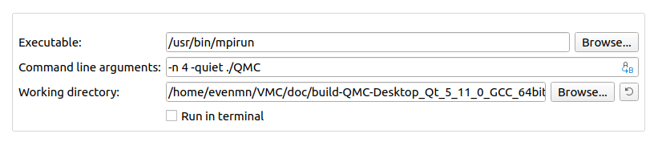

# VMC - General variational Monte-Carlo solver written in C++

## Requirements
To run this project without issues, the most recent C++ version, C++17, is recommended. In addition, a few external packages are required, that is
- Eigen (for linear algera operations)
- MPI (for parallel processing)

## Build & run
There are several ways to compile the code. Below, we will present two easy and rebust methods based on CMake and QMake. 

### CMake
1. chmod +x CompileVMC
2. ./CompileVMC
3. mpiexec -n _NumProcs_ ./vmc or mpirun -n _NumProcs_ vmc
4. make clean

_NumProcs_ is number of parallel processes

### QMake (QT-creator)
1. [Download QT-creator](https://www.qt.io/download-qt-installer?hsCtaTracking=9f6a2170-a938-42df-a8e2-a9f0b1d6cdce%7C6cb0de4f-9bb5-4778-ab02-bfb62735f3e5)
2. Configurate the building file QMC.pro
3. Run using '''ctrl + R'''

#### Parallel processing using QT-creator
To run in parallel, one needs to add a run configuration that supports this. Go to Projects-> Run-> Add-> Custom Executable. Then set
- Executable: /usr/bin/mpirun
- Command line arguments: -n _NumProcs_ -quiet ./QMC
- Working directory: /where/the/executable/is

where _NumProcs_ is number of parallel processes. An example implementation is showed below

## Adjust parameters
All necessary adjustments can currently be done in '''main.cpp'''
