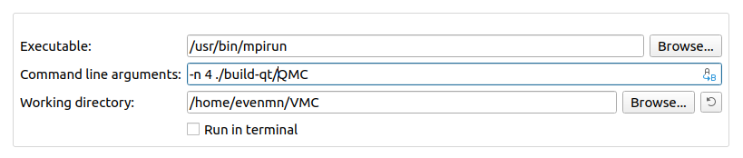
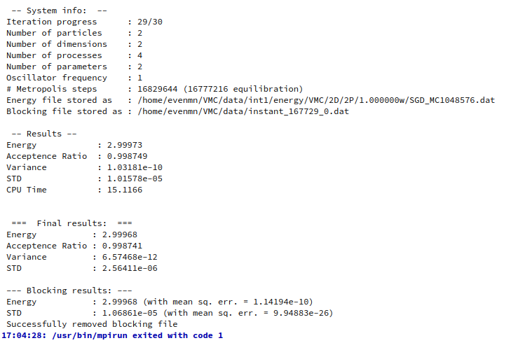

# VMC
----------------------
VMC is a general variational Monte-Carlo solver written in C++. It was implemented with respect to being flexible, such that various wave functions based on neural networks easily can added. At this point, several machine learning wave functions are already implemented, in particular based on Gaussian-binary Boltzmann machines. 

## Prerequisites
To run this project without issues, the most recent C++ version, C++17, is recommended. In addition, a few external packages are required, that is
- MPI
- Eigen
- Blocker
- TQDM

### MPI
MPI is used in parallel processing. On Linux, the package can be installed by the following commands
```bash
sudo apt-get install libopenmpi-dev
sudo apt-get install openmpi-bin
```
MPI is also availiable on other systems.

### Eigen
Eigen is a C++ template library for linear algebra operations. See 
[http://eigen.tuxfamily.org/](http://eigen.tuxfamily.org/) for installation details.

### Blocker
Blocker is an auto blocking package developed by Marius Jonsson, which is our preffered resampling tool. To get the package, go to [https://github.com/computative/](https://github.com/computative/) and clone the repository. 

### TQDM
The TQDM package provides fast and clean progress bars built in the for loops. To get the package, go to [https://github.com/tqdm/tqdm.cpp](https://github.com/tqdm/tqdm.cpp) and clone the repository. 

-------------------

## Build & run
There are several ways to compile and run the code. Below, we will present two easy and rebust methods based on CMake and QMake. 

### CMake
```bash
1. chmod +x CompileVMC
2. ./CompileVMC
3. mpirun -n 4 -quiet vmc
4. make clean
```
for 4 parallel processes.

### QMake (QT-creator)
1. [Download QT-creator](https://www.qt.io/download-qt-installer?hsCtaTracking=9f6a2170-a938-42df-a8e2-a9f0b1d6cdce%7C6cb0de4f-9bb5-4778-ab02-bfb62735f3e5)
2. Configurate the building file QMC.pro
3. Run using ```ctrl``` + ```R```

#### Parallel processing using QT-creator
To run in parallel, one needs to add a run configuration that supports this. Go to Projects-> Run-> Add-> Custom Executable. Then set
- Executable: ```/usr/bin/mpirun```
- Command line arguments: ```-n 4 -quiet ./QMC```
- Working directory: ```/where/the/executable/is```

again for 4 parallel processes. An example implementation is showed below


-------------------

## Adjust parameters
All adjustable parameters can currently be found in ```main.cpp```, including

- number of particles
- number of dimensions
- wave function structure

in addition to more technical settings. 

-------------------

## Getting results
### Energy and blocking results
The current energy is printed to the terminal for every iteration, together with the estimated variance, standard deviation, acceptence ratio and CPU time. _System info_ presents the settings used for the current run.

For the last iteration, blocking is performed and the blocking results are printed to the terminal in the very end. The terminal will typically look like this when a run is done:


The energies for all iterations are stored in a file found in the data folder. The exact location and file name is also printed to the terminal, see image above. To plot this energy file, run 
```bash
python3 scripts/plot_energy.py
```
which also support multiple files. 

### One-body density
The one-body density is calculated during the last iteration by default, and the file is stored in the same way as the energy files described above. The one-body density can be plotted by 
```bash
python3 scripts/plot_ob_density.py
```
which again supports multiple files. Remember to set correct number of dimensions inside the script!

-------------------

## Licence
[MIT](https://choosealicense.com/licenses/mit/)
