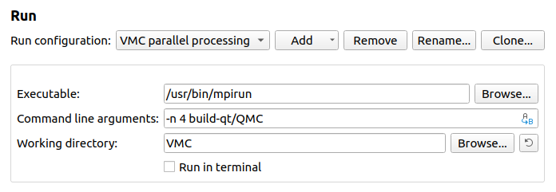
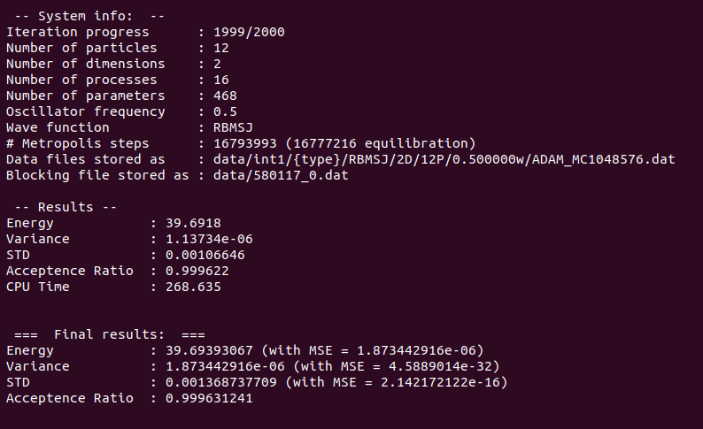

# VMC
----------------------
VMC is a general variational Monte-Carlo solver written in object-oriented C++. It was implemented with the aim of being flexible, fast and readable.

## Prerequisites
To run the code without issues, the most recent C++ version, C++17, is recommended. In addition, a few external packages are required:
- MPI
- Eigen
- Blocker

### MPI
MPI is used for parallel processing. On Linux, the package can be installed by the following commands
```bash
sudo apt-get install libopenmpi-dev
sudo apt-get install openmpi-bin
```
MPI is also avaliable on other platforms.

### Eigen
Eigen is a C++ template library for linear algebra operations. See 
[http://eigen.tuxfamily.org/](http://eigen.tuxfamily.org/) for installation details.

### Blocker
Blocker is an auto blocking package developed by Marius Jonsson, which is our preferred resampling tool. To get the package, go to [https://github.com/computative/block](https://github.com/computative/block) and clone the repository. 

-------------------

## Build
There are several ways to build the code, and below we will present two easy and rebust methods based on CMake and QMake, respectively. 

### CMake
```bash
1. mkdir build
2. cd build
3. cmake ../
4. make -j4
```
or simply run ```./CompileVMC```. The executable is then found in the ```build``` folder.

### QMake (QT-creator)
1. [Download QT-creator](https://www.qt.io/download-qt-installer?hsCtaTracking=9f6a2170-a938-42df-a8e2-a9f0b1d6cdce%7C6cb0de4f-9bb5-4778-ab02-bfb62735f3e5)
2. Configure the building file ```QMC.pro```

The project can then be run in QT-creator using ```ctrl``` + ```R```.

#### Parallel processing using QT-creator
To run in parallel, one needs to add a run configuration that supports this. Go to ```Projects-> Run-> Add-> Custom Executable```. Then set
- Executable: ```/usr/bin/mpirun```
- Command line arguments: ```-n 4 build-qt/QMC```
- Working directory: ```/where/the/executable/is```

This setup will run 4 parallel processes. The executable is dropped to ```build-qt/```. The settings window should look similar to this


-------------------

## Set up system
The parameters can be set in two different ways:

1. They can be specified in ```main.cpp```
2. They can be specified in a config file

In general, the settings from the config file overwrite the setting in ```main.cpp```, which again overwrites the default settings found in ```system.h```.

### From ```main.cpp```
From ```main.cpp```, all possible settings can be adjusted. Below, we present a minimalistic example on how main could look like for a two-dimensional quantum dot system with 6 electrons and frequency 1. We choose a Slater-Jastrow wave function as our trial wave function.
``` c++
#include "main.h"

int main(int argc, char** argv)
{
    // Define system
    System *QD = new System();

    QD->setNumberOfParticles(6);
    QD->setNumberOfDimensions(2);
    QD->setFrequency(1.0);
    QD->setInteraction(true);

    QD->setLearningRate(0.1);
    QD->setStepLength(0.05);
    QD->setNumberOfMetropolisSteps(int(pow(2, 20)));

    QD->setHamiltonian(new HarmonicOscillator(QD));

    // Define trial wave function
    QD->setBasis(new Hermite(QD));
    QD->setWaveFunctionElement(new Gaussian(QD));
    QD->setWaveFunctionElement(new SlaterDeterminant(QD));
    QD->setWaveFunctionElement(new PadeJastrow(QD));
    
    QD->setNumberOfIterations(1000);
    QD->runSimulation();
    return 0;
}
```
We first define the physical system and then we define method related tools. ```main.h``` needs to be included in order to pass the objects ```HarmonicOscillator(QD)```, ```Hermite(QD)``` and so on. Apart from the system declaration and simulation call, the order of calls is irrelevant. Everything that is not specified in ```main.cpp``` will stay by the default. 

### From config
The config file, ```config```, needs to be passed as an argument when running the code,
```bash
mpirun -n 4 build/dotnet config
```
The advantage of this is that we can change parameters without compiling the code again, which allows us to run multiple simulations in parallel. In particular, this is beneficial when running large simulations on computer clusters. To tell the program to access the config file, simply add
```c++
QD->initializeFromConfig(argc, argv);
```
to ```main.cpp```. An example on such a config file is found in [config](config). 

-------------------

## Getting results
### Energy and blocking results
The current energy is printed to the terminal for every iteration, together with the estimated variance, standard deviation, acceptence ratio and CPU time. _System info_ presents the settings used for the current run.

For the last iteration, blocking is performed and the blocking results are printed to the terminal in the very end. The terminal will typically look like this when a run is done:


The energies for all iterations are stored in a file found in the data folder. The exact location and file name is also printed to the terminal, see image above. To plot this energy file, run 
```bash
python3 scripts/plot_energy.py
```
which also support multiple files. 

### One-body density
The one-body density is calculated during the last iteration by default, and the file is stored in the same way as the energy files described above. The one-body density can be plotted by 
```bash
python3 scripts/plot_ob_density.py
```
which again supports multiple files. Remember to set correct number of dimensions inside the script!

-------------------

## Licence
[MIT](https://choosealicense.com/licenses/mit/)
